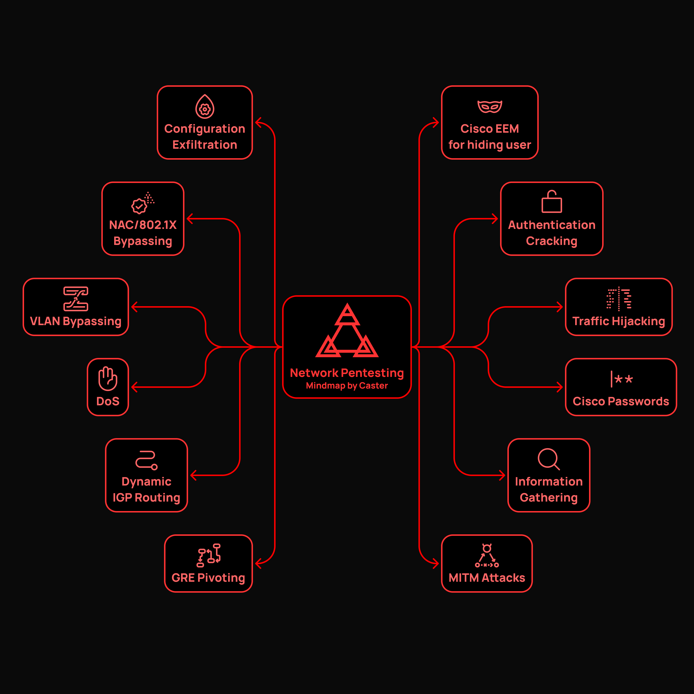

# NetworkNightmare
**"Network Nightmare" Mindmap by Caster**

It is a mindmap for conducting network attacks. For the most part, it will be useful to pentesters or red team operators.
The mindmap will be maintained and updated by me.

# Disclaimer

**All information contained in this repository is provided for educational and research purposes only. The author is not responsible for any illegal use of this tool**

## Cover

## Chapters
1. Traffic Hijacking
2. MiTM Attacks
3. Dynamic IGP Routing
4. Configuration Exfiltration
5. DoS
6. NAC/802.1X Bypassing
7. GRE Pivoting
8. Cisco EEM for hiding user
9. Authentication Cracking
10. Information Gathering
11. Cisco Passwords
12. VLAN Bypassing
